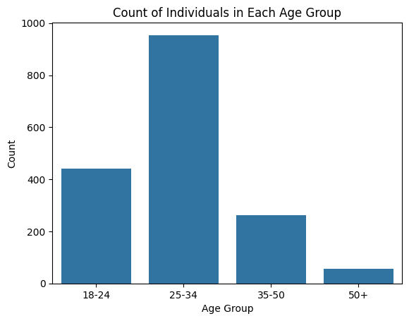
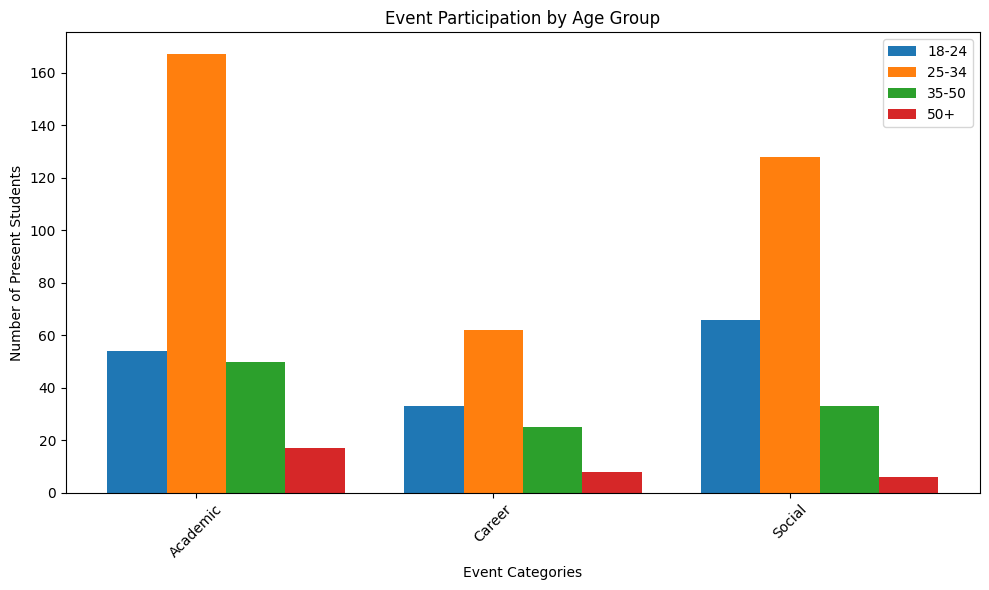
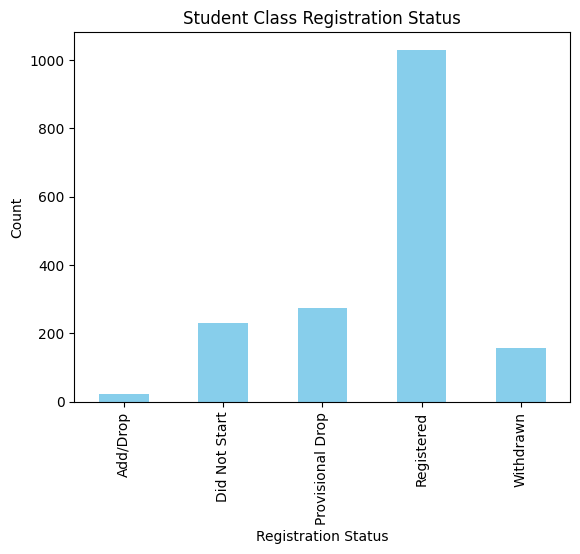
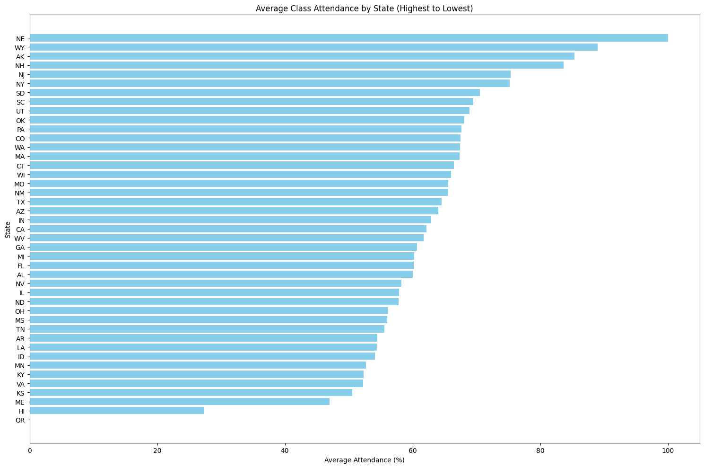
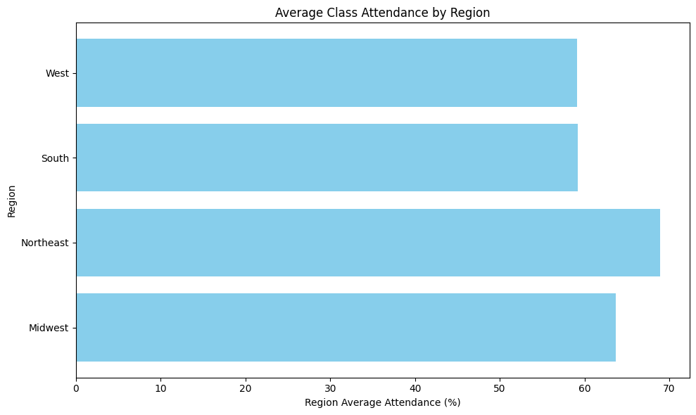
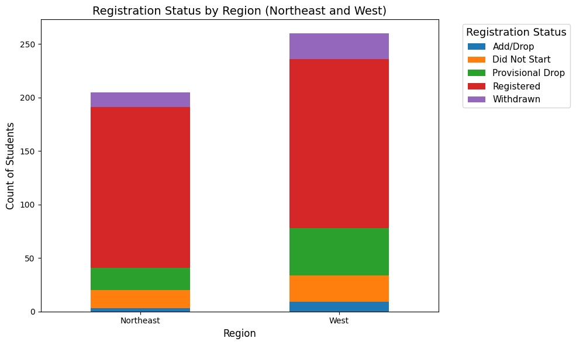
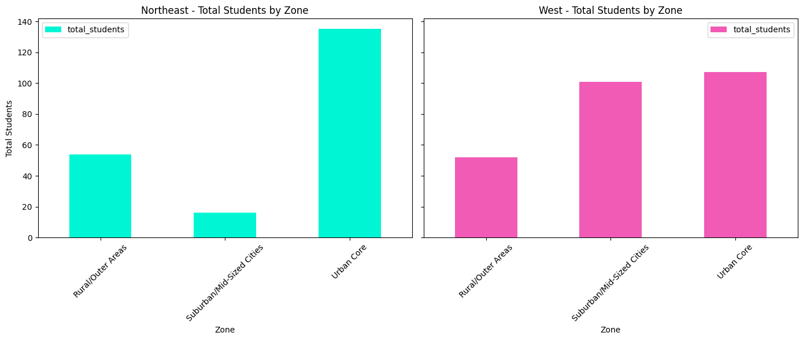
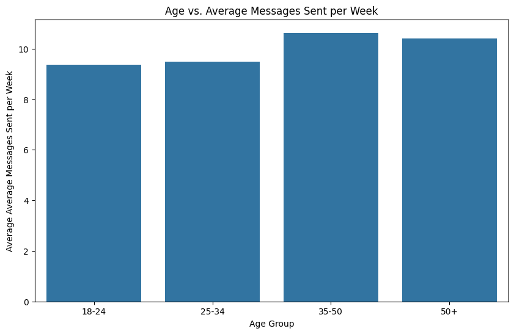
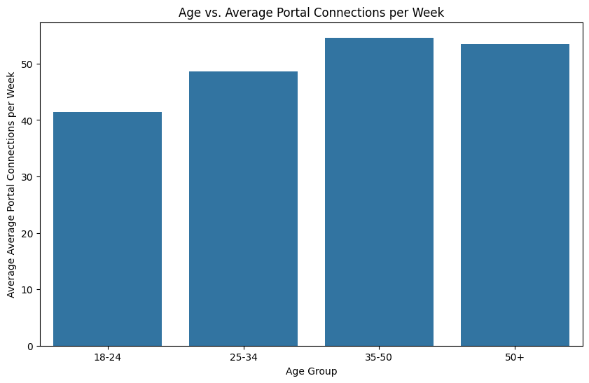
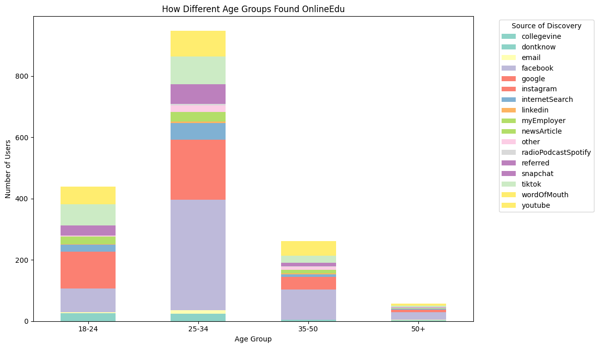

# OnlineEdu*

This is a business case utilizing various datasets from OnlineEdu to analyze the different trends and changes for three unique aspects: Event Attendance, Class Performance, and Platform Engagement. There is an accompanying Google Slideshow with my analysis along with the code and Excel files within this repository.

The following datasets were supplied to me for this analysis:
- Demographic Data
- Event Attendance Data
- Class Performance Data
- Platform Engagement Data

To analyze each section of data, I segmented the data utilizing the following:
- Event Attendance: Age Group (Demographic Data)
- Class Performance: Geographic Location
- Platform Engagement: Age Group (Demographic Data)

## Event Attendance
### Counts of All Age Groups Visualization

### Age Group Counts Summary
| Age Group | Count |
| ------------- | ------------- |
| 18-24  | 440  |
| 25-34 | 954  |
| 35-50  | 262  |
| 50+ | 57  |
| **Total** | **1713**  |

### Event Participation by Age Group (Sample Records)
| Event Date & Name                                                             | 18-24 | 25-34 | 35-50 | 50+ | Category  |
|-------------------------------------------------------------------------------|-------|-------|-------|-----|-----------|
| 2024-10-10_OPTIONAL Office Hours with Director of Student Affairs            |  12   |  26   |  19   |  3  | Academic  |
| 2024-10-11_OnlineEdu Debate Club                                             |   3   |  10   |   1   |  0  | Social    |
| 2024-10-13_OnlineEdu Debate Club                                             |   3   |   7   |   2   |  0  | Social    |
| 2024-10-15_Transfer Tuesday with SNHU                                        |  17   |  70   |  19   |  4  | Academic  |
| 2024-10-16_Caffeinated Chasers Between the Enchanted Covers Book Club       |   3   |   5   |   0   |  0  | Social    |

### Event Participation Age Group Totals
| Event Category | Attendance Count |
|----------------|------------------|
| Academic       | 405              |
| Career         | 128              |
| Social         | 233              |
| **Total**      | **766**          |

### Event Participation Age Group Distribution Visualization

#### Age Group: 18-24
| Event Category | Event Attendees |
|----------------|------------------|
| Academic       | 80               |
| Career         | 33               |
| Social         | 66               |
| **Total**      | **179**          |

#### Age Group: 25-34
| Event Category | Event Attendees |
|----------------|------------------|
| Academic       | 221              |
| Career         | 62               |
| Social         | 128              |
| **Total**      | **411**          |

#### Age Group: 35-50
| Event Category | Event Attendees |
|----------------|------------------|
| Academic       | 81               |
| Career         | 25               |
| Social         | 33               |
| **Total**      | **139**          |

#### Age Group: 50+
| Event Category | Event Attendees |
|----------------|------------------|
| Academic       | 23               |
| Career         | 8                |
| Social         | 6                |
| **Total**      | **37**           |

### Analysis Insights
- Approximately 45.5% of total learners attended OnlineEdu events between October and December 2024.
    - Approximately 40.7% of learners ages 18-24 attended OnlineEdu events between October and December 2024.
    - Approximately 43.1% of learners ages 25-34 attended OnlineEdu events between October and December 2024.
    - Approximately 53.1% of learners ages 35-50 attended OnlineEdu events between October and December 2024.
    - Approximately 64.9% of learners ages 50+ attended OnlineEdu events between October and December 2024.
- Student Event Attendance Motivation:
    - 18-24 Learners Preferred Events Based on Attendance: 
        - Academic, Social, Career
    - 25-34 Learners Preferred Events Based on Attendance:
        - Academic, Social, Career
    - 35-50 Learners Preferred Events Based on Attendance:
        - Academic, Social, Career
    - 50+ Learners Preferred Events Based on Attendance:
        - Academic, Career, Social

### OnlineEdu's Strengths - Event Attendance
- Academic Events have the highest attendance across all age groups.
- Despite having the least total learners, over 50% of learners ages 50+ have the greatest presence in OnlineEdu events compared to other age groups.
- Learners ages 25-34 have the highest group presence across all three event categories (Academic, Career, and Social).

### Actionable Insights
- Host more career events tailored to all age groups.
    - Examples:
        - Initial Resume Writing, Cover Letter Workshops, Mock Interview Practice, etc. (geared toward those who are at the beginning of career)
        - Resume Reviews, Cover Letter Revision Workshops, Mock Interview Practice, etc. (geared toward those who are in the middle of their career or want to shift career fields)
        - General: Recruiting Events, Expert Panels, Career Fairs
- Capitalize on Academic event presence.
    - Perform a more in-depth analysis on the kinds of events each age group is attending and utilize those findings to help improve strategy across all age groups.
        - Examples:
            - Hosting more Transfer Tuesdays with other universities, University Information Sessions, etc.
- Engage the 50+ learner community to attend social events based on their interests.
    - Conduct a survey of interest among this demographic and utilize these results to help formulate social events that could draw in more learners to attend events.
        - Examples:
            - Skill-Building Activities, Health and Wellness Events, Book Clubs, Networking Events, etc.

## Class Performance
### Student Class Registration Status
| Registration Status | Count |
|---------------------|-------|
| Registered          | 1030  |
| Provisional Drop    | 273   |
| Withdrawn           | 157   |
| Did Not Start       | 179   |
| Add/Drop            | 24    |
| **Total**           | **1713** |

### Student Class Registration Status Visualization

### Class Attendance by State (Sample Records)
| State | Avg. Class Attendance (%) | Total Students |
|--------|----------------------------|----------------|
| AK     | 85.3                       | 1              |
| AL     | 60.0                       | 41             |
| AR     | 54.5                       | 36             |
| AZ     | 64.0                       | 38             |
| CA     | 62.2                       | 137            |

### Class Attendance by State Visualization

#### 🟢 States with the Highest Class Attendance
| State         | Attendance (%) | Student Total |
|---------------|----------------|----------------|
| Nebraska      | 100.0          | 1              |
| Wyoming       | 89.0           | 1              |
| Arkansas      | 85.3           | 1              |
| New Hampshire | 83.7           | 1              |
| New Jersey    | 75.2           | 37             |

#### 🔴 States with the Lowest Class Attendance
| State    | Attendance (%) | Student Total |
|----------|----------------|----------------|
| Virginia | 52.3           | 29             |
| Kansas   | 50.6           | 11             |
| Maine    | 47.0           | 2              |
| Hawaii   | 27.3           | 1              |
| Oregon   | 0.0            | 1              |

### Class Attendance By Region (Sample Records)
| State | Avg. Class Attendance (%) | Total Students | Region  |
|--------|----------------------------|----------------|---------|
| OH     | 56.1                       | 86             | Midwest |
| WI     | 66.0                       | 4              | Midwest |
| SD     | 70.5                       | 8              | Midwest |
| NE     | 100.0                      | 1              | Midwest |
| ND     | 57.8                       | 4              | Midwest |

### Class Attendance By Region Visualization

### Regional Class Attendance Summary
| Region    | Total Students | Avg. Regional Class Attendance (%) |
|-----------|----------------|-----------------------------------|
| West      | 260            | 59.1                              |
| South     | 821            | 59.2                              |
| Midwest   | 359            | 63.7                              |
| Northeast | 205            | 69.0                              |

### Northeast and West Zip Codes
| Region    | States | Zip Codes                                                                                                                                                                                                 |
|-----------|--------|-----------------------------------------------------------------------------------------------------------------------------------------------------------------------------------------------------------|
| Northeast | MA, NY, NJ, NH, ME, PA, CT | 10009, 10025, 10029, 10032, 10033, 1013, 1028, 1040, 10451, 10452, 10453, 10454, 10455, 10456, 10458, 10459, 10462, 10466, 10468, 10469, 10552, 10705, 10980, 1107, 1108, 11106, 11208, 11210, 11213, 11216, 11218, 11222, 11226, 11234, 11236, 11368, 11372, 11385, 11421, 11435, 1151, 11520, 11550, 11580, 11692, 11727, 12198, 13069, 13357, 13501, 13679, 13901, 14213, 14609, 14613, 1510, 15110, 15132, 15146, 15148, 15219, 15221, 15461, 15904, 1602, 16335, 16701, 16841, 16915, 17025, 17046, 17055, 17061, 17068, 17113, 17314, 17340, 17364, 17403, 17404, 17527, 17562, 17601, 17602, 17603, 17701, 17745, 17851, 17922, 17948, 18015, 18102, 18202, 18370, 18505, 18510, 1854, 18612, 18655, 18702, 18708, 19007, 1902, 19026, 19079, 19111, 19116, 19121, 19124, 19126, 19131, 19132, 19133, 19134, 19138, 19143, 19144, 19355, 19604, 19605, 19606, 1970, 2062, 2072, 2118, 2119, 2124, 2129, 2136, 2151, 2301, 2322, 2368, 2767, 3878, 4055, 4654, 6010, 6042, 6105, 6114, 6118, 6260, 6320, 6340, 6405, 6492, 6516, 6518, 6704, 6854, 6902, 7017, 7018, 7062, 7083, 7088, 7093, 7095, 7107, 7203, 7304, 7305, 7410, 7504, 7644, 7801, 8016, 8021, 8080, 8094, 8104, 8109, 8302, 8332, 8349, 8401, 8611, 8618, 8690, 8865, 8884 |
| West      | UT, WA, AK, NV, NM, ID, HI, CO, CA, AZ, OR, WY | 38135, 80010, 80012, 80013, 80016, 80022, 80023, 80031, 80204, 80205, 80239, 80301, 80631, 80817, 80903, 80904, 80915, 80924, 81089, 81240, 81403, 82054, 83221, 83642, 83683, 83702, 83714, 84005, 84096, 84104, 84107,

### Class Registration Status By Region (Sample Records)
| Registration Status | Region     | Count  |
|---------------------|------------|--------|
| Registered          | West       | 1030   |
| Registered          | Northeast  | 1030   |
| Add/Drop            | West       | 24     |

### Class Registration Status By Region Visualization

### Class Registration Status By Region Totals
| Region    | Registration Type | Total |
|-----------|-------------------|-------|
| Northeast | Add/Drop          | 3     |
| Northeast | Did Not Start     | 17    |
| Northeast | Provisional       | 21    |
| Northeast | Registered        | 150   |
| Northeast | Withdrawn         | 14    |
| West      | Add/Drop          | 9     |
| West      | Did Not Start     | 25    |
| West      | Provisional       | 44    |
| West      | Registered        | 158   |
| West      | Withdrawn         | 24    |

### Class Registration Status By Zip Code (Sample Records)
| Region    | Registration Status | Zip Code |
|-----------|---------------------|----------|
| West      | Registered          | 95660    |
| Northeast | Registered          | 17061    |
| Northeast | Registered          | 19133    |
| West      | Add/Drop            | 83221    |

### Class Registration Status by Zip Code Group
#### Northeast Region Combined Counts (Total Students and Registration Status) - Sample Records:
| Zip Code Group | Total Students | Add/Drop | Did Not Start | Provisional Drop | Registered | Withdrawn |
|----------------|----------------|----------|---------------|------------------|------------|-----------|
| 100            | 5              | 0        | 0             | 0                | 5          | 0         |
| 101            | 1              | 0        | 1             | 0                | 0          | 0         |
| 102            | 1              | 0        | 0             | 1                | 0          | 0         |
| 104            | 16             | 0        | 0             | 2                | 12         | 2         |

#### West Region Combined Counts (Total Students and Registration Status) - Sample Records:
| Zip Code Group | Total Students | Add/Drop | Did Not Start | Provisional Drop | Registered | Withdrawn |
|----------------|----------------|----------|---------------|------------------|------------|-----------|
| 381            | 1              | 0        | 0             | 1                | 0          | 0         |
| 800            | 7              | 1        | 0             | 1                | 5          | 0         |
| 802            | 4              | 0        | 0             | 1                | 3          | 0         |
| 803            | 1              | 0        | 0             | 0                | 1          | 0         |

### Class Registration Status by Zip Code Group & Zone
#### Northeast Region Combined Counts (Total Students and Registration Status) - Sample Records:
| Zip Code Group | Total Students | Add/Drop | Did Not Start | Provisional Drop | Registered | Withdrawn | Region   | Zone        |
|----------------|----------------|----------|---------------|------------------|------------|-----------|----------|-------------|
| 100            | 5              | 0        | 0             | 0                | 5          | 0         | Northeast | Urban Core  |
| 101            | 1              | 0        | 1             | 0                | 0          | 0         | Northeast | Urban Core  |
| 102            | 1              | 0        | 0             | 1                | 0          | 0         | Northeast | Urban Core  |
| 104            | 16             | 0        | 0             | 2                | 12         | 2         | Northeast | Urban Core  |

#### West Region Combined Counts (Total Students and Registration Status) - Sample Records:
| Zip Code Group | Total Students | Add/Drop | Did Not Start | Provisional Drop | Registered | Withdrawn | Region | Zone             |
|----------------|----------------|----------|---------------|------------------|------------|-----------|--------|------------------|
| 381            | 1              | 0        | 0             | 1                | 0          | 0         | West   | Rural/Outer Areas|
| 800            | 7              | 1        | 0             | 1                | 5          | 0         | West   | Urban Core       |
| 802            | 4              | 0        | 0             | 1                | 3          | 0         | West   | Urban Core       |
| 803            | 1              | 0        | 0             | 0                | 1          | 0         | West   | Urban Core       |

### Class Registration By Zone Visualization

### Distribution of Students Across Zones Summary
| Region           | Zone                     | Total Students | % of Total Regional Learners |
|------------------|--------------------------|----------------|-------------------------------|
| Northeast Region | Rural/Outer Areas        | 54             | 26.3%                         |
| Northeast Region | Suburban/Mid-Sized Cities| 16             | 7.8%                          |
| Northeast Region | Urban Core               | 135            | 65.9%                         |
| **Northeast Region Total** |                  | **205**        | **100%**                      |
| West Region      | Rural/Outer Areas        | 52             | 20.0%                         |
| West Region      | Suburban/Mid-Sized Cities| 101            | 38.8%                         |
| West Region      | Urban Core               | 107            | 41.2%                         |
| **West Region Total**      |                  | **260**        | **100%**                      |

#### Northeast Region Students Based on Zone & Registration Status
| Zone                   | Total Students | % of Add/Drop | % of Did Not Start | % of Provisional Drop | % of Registered | % of Withdrawn |
|------------------------|----------------|----------------|---------------------|------------------------|------------------|----------------|
| Rural/Outer Areas      | 54             | 1.85%          | 5.56%               | 9.26%                  | 74.07%           | 9.26%          |
| Suburban/Mid-Sized Cities | 16         | 6.25%          | 6.25%               | 6.25%                  | 81.25%           | 0.00%          |
| Urban Core             | 135            | 0.74%          | 9.63%               | 11.11%                 | 71.85%           | 6.67%          |
| **Total**              | **205**        |                 |                    |                         |                |                |

**Avg Regional Percentage** | **2.95%** | **7.15%** | **8.87%** | **75.73%** | **5.31%** |

#### West Region Students Based on Zone & Registration Status
| Zone                   | Total Students | % of Add/Drop | % of Did Not Start | % of Provisional Drop | % of Registered | % of Withdrawn |
|------------------------|----------------|----------------|---------------------|------------------------|------------------|----------------|
| Rural/Outer Areas      | 52             | 3.85%          | 3.85%               | 17.31%                 | 61.54%           | 13.46%         |
| Suburban/Mid-Sized Cities | 101         | 1.98%          | 10.89%              | 20.79%                 | 58.42%           | 7.92%          |
| Urban Core             | 107            | 4.67%          | 11.21%              | 13.09%                 | 62.62%           | 8.41%          |
| **Total**              | **260**        |                 |                    |                         |                |                |

| **Avg Regional Percentage** | **3.5%** | **8.65%** | **17.06%** | **60.86%** | **9.93%** |

#### Northeast and West Regional Zone Registration Status Comparison
| Region     | Avg % Add/Drop | Avg % Did Not Start | Avg % Provisional Drop | Avg % Registered | Avg % Withdrawn |
|------------|----------------|----------------------|-------------------------|-------------------|-----------------|
| Northeast  | 2.95%          | 7.15%                | 8.87%                   | 75.73%            | 5.31%           |
| West       | 3.50%          | 8.65%                | 17.06%                  | 60.86%            | 9.93%           |

#### Registration Distribution by Region and Zone
| Region     | Zone                   | % Add/Drop | % Did Not Start | % Provisional Drop | % Registered | % Withdrawn |
|------------|------------------------|------------|------------------|---------------------|---------------|--------------|
| Northeast  | Rural/Outer Areas      | 1.85%      | 5.56%            | 9.26%               | 74.07%        | 9.26%        |
| Northeast  | Suburban/Mid-Sized Cities | 6.25%   | 6.25%            | 6.25%               | 81.25%        | 0%           |
| Northeast  | Urban Core             | 0.74%      | 9.63%            | 11.11%              | 71.85%        | 6.67%        |
| West       | Rural/Outer Areas      | 3.85%      | 3.85%            | 17.31%              | 61.54%        | 13.46%       |
| West       | Suburban/Mid-Sized Cities | 1.98%   | 10.89%           | 20.79%              | 58.42%        | 7.92%        |
| West       | Urban Core             | 4.67%      | 11.21%           | 13.09%              | 62.62%        | 8.41%        |

### Registration by Region and Zone Summary
| Region     | Zone                    | % Registered | % Other Status |
|------------|-------------------------|---------------|----------------|
| Northeast  | Suburban/Mid-Sized Cities | 81.25%       | 18.75%         |
| Northeast  | Rural/Outer Areas       | 74.07%         | 25.93%         |
| Northeast  | Urban Core              | 71.85%         | 28.15%         |
| West       | Urban Core              | 62.62%         | 37.38%         |
| West       | Rural/Outer Areas       | 61.54%         | 38.46%         |
| West       | Suburban/Mid-Sized Cities | 58.42%       | 41.58%         |

### Analysis Insights
- Approximately 60% of total learners have a “Registered” class registration status with 1030 enrolled students.
- The US region with the highest average attendance percentage is the Northeast (69%).
    - MA, NY, NJ, NH, ME, PA, CT
- The US region with the lowest average attendance percentage is the West (59.1%).
- The Northeast and West regions’ highest categorical registration status is “Registered” and lowest categorical registration status is “Add/Drop”.
- Most students in the Northeast and West reside in an urban core area.
- Northeast suburban/mid-sized cities have the highest regional zone percentage of students classified as “Registered” (81.25%) and the lowest regional zone percentage of students with a non-registered registration status (18.75%).
- West suburban/mid-sized cities have the lowest regional zone percentage of students classified as “Registered” (58.42%) and the highest regional zone percentage of students with a non-registered registration status (41.58%).

### OnlineEdu’s Strengths - Class Performance
- Over 50% of students who are members of OnlineEdu are registered for at least one class. 
- In the regions that have the highest and lowest average class attendance, majority of students in those regions have a registration status of “Registered”.
- All four regions have an average attendance rate above 50%, suggesting strong student engagement across the board, with potential to further improve participation in areas with slightly lower attendance.

### Actionable Insights
- Conduct an analysis to identify the underlying factors contributing to the increased percentage of non-registered statuses in suburban mid-sized cities within the western region.
    - Conduct an anonymous survey to understand the reasons behind students' withdrawal from courses. Analyzing the responses will help us create targeted resources and support services that address the unique challenges of students with similar experiences, ultimately enhancing retention and engagement.
- Analyze the factors driving student participation in courses.
    - Conduct a survey to understand the factors motivating students to attend classes. Potential reasons may include engaging course content, inspiring professors, career aspirations, skill development, or professional advancement.
- Evaluate the impact of online learning environments on student engagement and course completion rates across different regions.
    - Survey students about their online learning experience to identify barriers to engagement and gather insights on how to improve participation and course effectiveness.

## Platform Engagement
### Age vs. Average Average Messages Sent per Week Summary
| Age Group | Avg Messages Sent per Week |
|-----------|-----------------------------|
| 18–24     | 9.36                        |
| 25–34     | 9.49                        |
| 35–50     | 10.63                       |
| 50+       | 10.41                       |

### Age vs. Average Average Messages Sent per Week Visualization

### Age vs. Average Portal Connections per Week Summary
| Age Group | Avg Portal Connections per Week |
|-----------|----------------------------------|
| 18–24     | 41.47                            |
| 25–34     | 48.65                            |
| 35–50     | 54.61                            |
| 50+       | 53.41                            |

### Age vs. Average Portal Connections per Week Visualization

### How Different Age Groups Found OnlineEdu Visualization

### OnlineEdu's Top 5 Communication Methods
| Rank | Method        |
|------|---------------|
| 1    | Facebook      |
| 2    | Instagram     |
| 3    | TikTok        |
| 4    | YouTube       |
| 5    | Word of Mouth |

### Analysis Insights
- OnlineEdu Portal is being used the most by groups 35+ based on the average of the average messages sent and connections per week.
- Age groups 18-24 and 25-34 are not utilizing the message feature in OnlineEdu Portal as much as age groups 35+.
    - Likely due to having other means of communicating with other students and faculty/staff like email, text message, and social media.
- Increased weekly average Portal connections = Increased weekly average messages sent
- Overall Student OnlineEdu Portal Weekly Interactions:
    - 18-24 Learners: 
        - Average Messages Sent: 9.36
        - Average Connections: 41.47
    - 25-34 Learners:
        - Average Messages Sent: 9.49
        - Average Connections: 48.65
    - 35-50 Learners:
        - Average Messages Sent: 10.63
        - Average Connections: 54.61
    - 50+ Learners:
        - Average Messages Sent: 10.41
        - Average Connections: 53.41

#### Avg Messages Sent Ranked
| Rank | Age Group |
|------|-----------|
| 1    | 35–50     |
| 2    | 50+       |
| 3    | 25–34     |
| 4    | 18–24     |

#### Avg Portal Connections Ranked
| Rank | Age Group |
|------|-----------|
| 1    | 35–50     |
| 2    | 50+       |
| 3    | 25–34     |
| 4    | 18–24     |

### OnlineEdu’s Strengths - Platform Engagement
- OnlineEdu Portal is being primarily utilized by older learners (35+).
- The most effective means of spreading the word about OnlineEdu occurs on social media and word of mouth.
- Users across all age groups are actively building networks and engaging in meaningful interactions, beyond just sending messages.

### Actionable Insights
- Promote OnlineEdu Portal to younger age groups.
    - Promote the OnlineEdu Portal platform on social media (will help with Word of Mouth as well!)
        - Example: Use trending TikTok audios and general internet trends
    - Host information sessions displaying the multitude of uses for OnlineEdu Portal.
- Capitalize on the engagement of older groups.
    - Promote the opportunity for leadership positions on the platform.
        - Examples: Allow the opportunity for older members to host panels and virtual events to connect with younger learners on an academic and career level (Q&As, Study Groups, etc.)
- Conduct an analysis on what features are being utilized the most vs least across OnlineEdu Portal
    - Identifying the most and least utilized features will help guide improvements to the platform, which is likely to boost overall engagement.

*Disclaimer: OnlineEdu is a fake name used in order to protect the identity of this sample company data.
